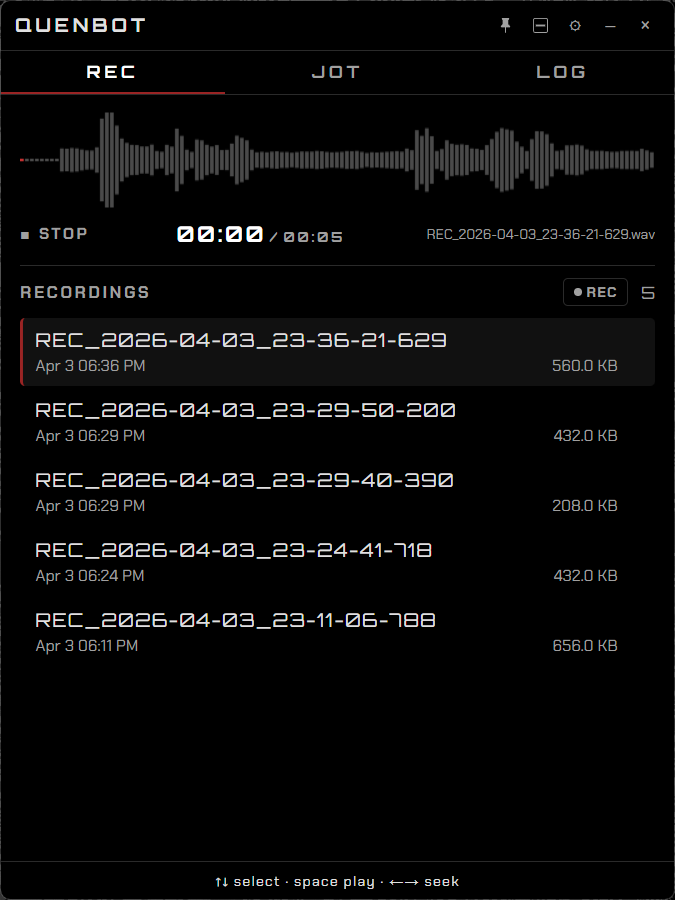
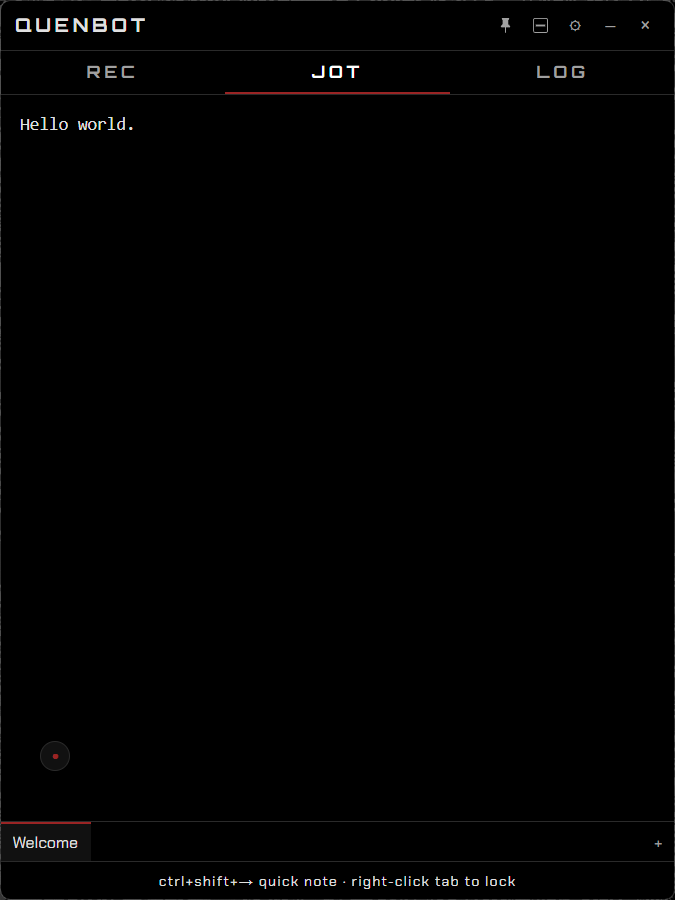
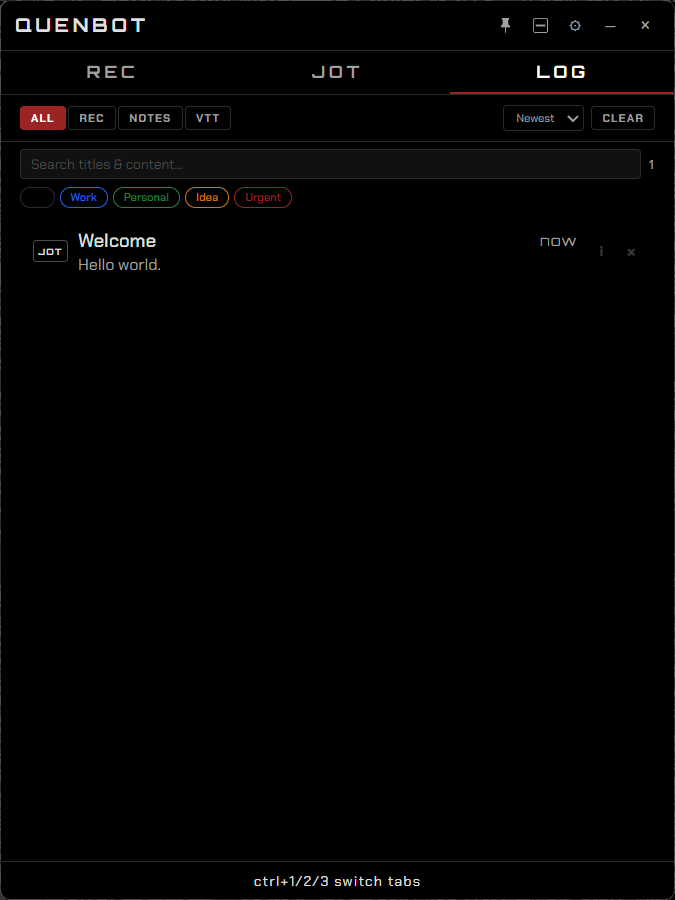
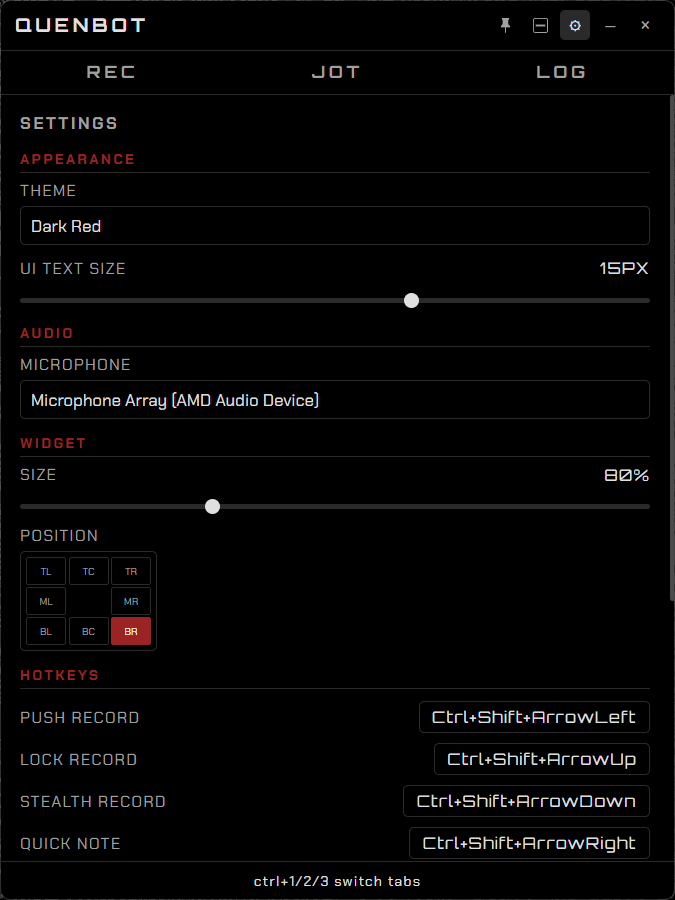
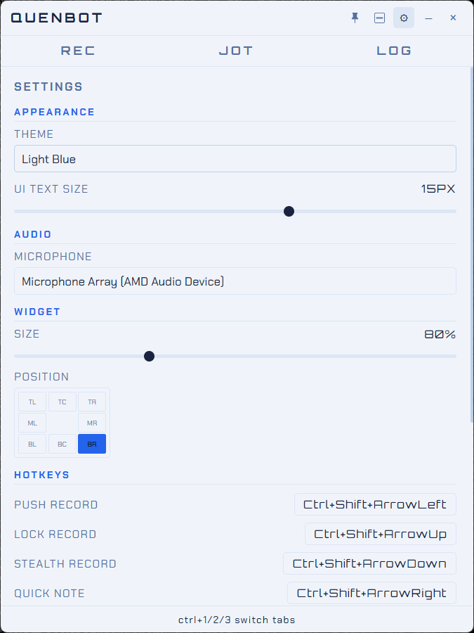
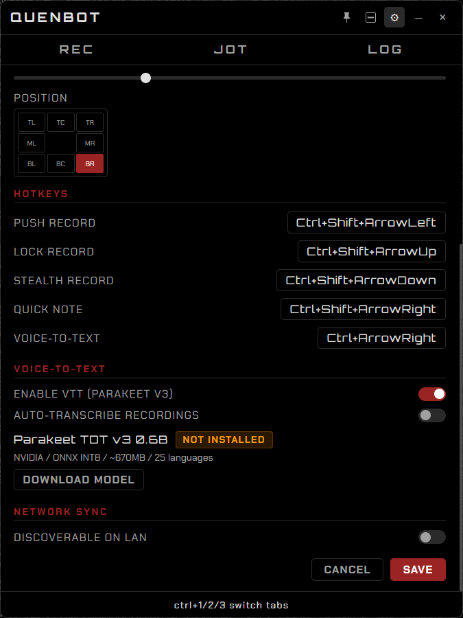

<div align="center">

# QUENBOT

**Audio recorder, note-taker, and voice-to-text — unified in one app.**

*Push-to-record · Rich text notes · Voice transcription · Project tags · Activity log · LAN sync · Mini mode — all from one compact desktop tool.*

> ***Quen*** — from *Quenta* (High Elvish): "tale," "account," or "narrative." Because every recording, every note, every transcription is part of a story worth keeping.

[](LICENSE)
[](https://www.electronjs.org/)
[](https://react.dev/)
[](https://www.typescriptlang.org/)
[](https://github.com/enkode/quenbot/releases)

</div>

---


*REC tab — Waveform player with transport controls, recording list with timestamps and file sizes. Push-to-record via global hotkey or the manual REC button.*

---

## What is QUENbot?

QUENbot is a desktop tool for capturing and organizing information quickly — whether that's a voice recording, a typed note, or speech-to-text transcription. One app, three input modes, all searchable and taggable.

Born from merging [RECbot](https://github.com/enkode/recbot) (audio recorder) and [jotbot](https://github.com/enkode/jotbot) (note-taker) into a single unified tool.

**Design language:** Dark industrial aesthetic. Chakra Petch body text, Orbitron display font, `#9A2424` accent red on black. 8 color themes including light variants. Information-dense, minimal chrome.

Built with Electron 40 + React 19 + TypeScript + electron-vite. Native Windows installer via NSIS.

---

## Screenshots

### REC — Audio Recording
Waveform visualization with play, pause, rewind (actual audio scrub), and fast-forward. Recording list with date, time, and file size. Manual REC button as an alternative to global hotkeys.


---

### JOT — Note Taking
TipTap rich text editor with Markdown support, image paste, and project tags. Multiple note tabs with drag-drop reorder, lock, and rename. Tag chip panel expands from the bottom-left corner.



---

### LOG — Activity History
Chronological feed of all recordings, notes, and transcripts. Filter by type (Rec/Notes/VTT), sort by newest/oldest/title/type, full-text search across titles and content. Color-coded project tag filtering. Expand any item for full details — date, size, path — with export to `.md` or `.txt`.



---

### Settings — Dark Theme
Full-page settings with auto-save. Theme selector, UI text scaling, microphone selection, widget size and position configurator with live desktop preview. Configurable hotkeys with one-click reset to defaults.



---

### Settings — Light Theme
8 color themes: 5 dark (Red, Blue, Green, Purple, Amber) and 3 light variants. All UI elements scale with the text size slider.



---

### Settings — Voice-to-Text & Network
Parakeet TDT v3 model management with download progress and status badge. Voice-to-text configuration. LAN discovery toggle with hostname or custom device name.



---

## Features

### REC — Audio Recording

- **Push-to-Record** — Hold `Ctrl+Shift+Left` to record, release to stop
- **Lock Recording** — Toggle `Ctrl+Shift+Up` for continuous recording
- **Stealth Mode** — `Ctrl+Shift+Down` records with no visible UI
- **Manual REC Button** — Click to start/stop recording from the app
- **Floating Widget** — Compact overlay with live waveform during recording
- **Widget Positioning** — 8 screen positions (corners, edges, centers) with live desktop preview
- **Configurable Widget Size** — 50% to 150% scaling
- **Audio Player** — Waveform visualization with play, pause, rewind, fast-forward
- **Audio Scrub** — Rewind/FF plays actual audio at 4x speed (reel-to-reel style)
- **Boundary Detection** — Seeking auto-stops at beginning and end of file
- **Recording Manager** — List, rename, delete recordings with date and file size
- **WAV Encoding** — 16-bit PCM with millisecond-precision filenames

### JOT — Note Taking

- **Rich Text Editor** — TipTap with StarterKit, Image, and Placeholder extensions
- **Markdown Support** — Auto-detects and converts pasted Markdown to rich text
- **Image Paste** — Paste images directly from clipboard (base64 embedded)
- **Multiple Notes** — Tabbed notes with create, rename, lock, delete
- **Drag-Drop Reorder** — Reorder note tabs by dragging
- **Lock Notes** — Right-click tab to toggle lock (prevents editing and deletion)
- **Project Tags** — Color-coded chips to organize notes by project
- **Tag Panel** — Hover the chip icon at bottom-left to expand, click to toggle tags
- **Custom Tags** — Create tags with custom names and 8 color choices
- **Debounced Save** — Content changes auto-save after 800ms of inactivity
- **Quick Note Hotkey** — `Ctrl+Shift+Right` opens app directly to JOT tab

### VTT — Voice-to-Text

- **Push-to-Transcribe** — Hold `Ctrl+Right` to speak, release to copy transcript to clipboard
- **Real-time Widget** — Green STT indicator shows live transcription progress
- **Clipboard Integration** — Transcript copied to clipboard on release, ready to paste
- **Parakeet TDT v3** — NVIDIA's latest ONNX model (25 languages, INT8 quantized, ~670MB)
- **Model Management** — Download with progress bar, status badge (green/yellow/red), update check
- **Auto-Transcribe** — Optionally transcribe new recordings automatically

### LOG — Activity History

- **Chronological Feed** — All recordings, notes, and transcripts in one view
- **Type Badges** — Color-coded REC/JOT/VTT labels for instant identification
- **Filter by Type** — All / Rec / Notes / VTT toggle buttons
- **Sort Options** — Newest, Oldest, Title, Type
- **Full-Text Search** — Search across titles and note content
- **Tag Filtering** — Filter by project chip labels with colored pills
- **Info Panel** — Expand any item for full timestamp, file size, file path
- **Export** — Save any item as `.md` or `.txt` to Downloads folder
- **Open in Folder** — Jump to recording files in Explorer
- **Clear All** — Wipe entire log history with confirmation

### App-Wide

- **8 Color Themes** — Dark Red, Dark Blue, Dark Green, Dark Purple, Dark Amber, Light, Light Blue, Light Green
- **Float Window** — Pin button keeps the app on top of all windows
- **Mini Mode** — Collapse to a compact draggable toolbar with quick-access buttons (REC, JOT, LOG, expand, close)
- **UI Text Scaling** — Adjustable text size from 10px to 18px, all elements scale proportionally
- **System Tray** — Runs in background, tray icon shows recording state
- **Auto-Save Settings** — Every settings change persists immediately (300ms debounce)
- **Configurable Hotkeys** — Remap all shortcuts with one-click reset to defaults
- **Desktop Shortcut** — Installs with app icon
- **LAN Discovery** — Discover other QUENbot instances on your network (coming soon)
- **Single Instance** — Prevents duplicate windows, focuses existing on re-launch

---

## Keyboard Shortcuts

| Shortcut | Action |
|----------|--------|
| `Ctrl+Shift+Left` | Push-to-record (hold to record, release to stop) |
| `Ctrl+Shift+Up` | Lock recording toggle |
| `Ctrl+Shift+Down` | Stealth recording toggle |
| `Ctrl+Shift+Right` | Quick note (opens JOT tab, focuses editor) |
| `Ctrl+Right` | Voice-to-text (hold to speak, release to copy) |
| `Ctrl+1` | Switch to REC tab |
| `Ctrl+2` | Switch to JOT tab |
| `Ctrl+3` | Switch to LOG tab |
| `Space` | Play / Pause (REC tab) |
| `Left Arrow` | Rewind (hold, REC tab) |
| `Right Arrow` | Fast-forward (hold, REC tab) |
| `Up / Down Arrow` | Navigate recording list (REC tab) |

All hotkeys except tab switching and VTT are configurable in Settings.

---

## Quick Start

```bash
git clone https://github.com/enkode/quenbot.git
cd quenbot
npm install
npm run dev      # Development mode with hot reload
npm run dist     # Build Windows installer
```

### Prerequisites

- [Node.js](https://nodejs.org/) 18+
- Windows 11/10

### Install from Installer

Download `QUENbot Setup 1.0.0.exe` from [Releases](https://github.com/enkode/quenbot/releases) and run it. The installer creates a desktop shortcut and Start menu entry.

---

## Data Storage

| Data | Location | Format |
|------|----------|--------|
| Recordings | `~/Music/quenbot/` | WAV (16-bit PCM) |
| Notes | `%APPDATA%/quenbot/notes.json` | JSON (TipTap HTML) |
| Tags | `%APPDATA%/quenbot/chips.json` | JSON |
| Activity Log | `%APPDATA%/quenbot/feed.json` | JSON |
| Settings | `%APPDATA%/quenbot/settings.json` | JSON |
| STT Model | `%APPDATA%/quenbot/models/` | ONNX (4 files) |
| App Log | `%APPDATA%/quenbot/quenbot.log` | Text |

---

## Tech Stack

| Layer | Technology |
|-------|-----------|
| Desktop Framework | Electron 40 |
| UI Library | React 19 |
| Language | TypeScript 5.8 |
| Build Tool | electron-vite 5 + Vite 6 |
| Rich Text Editor | TipTap 3.19 (StarterKit + Image + Placeholder) |
| Global Hotkeys | uiohook-napi |
| STT Model | Parakeet TDT v3 0.6B (ONNX INT8, 25 languages) |
| Audio Format | Web Audio API, 16-bit PCM WAV |
| Installer | electron-builder (NSIS) |
| Fonts | Chakra Petch (body), Orbitron (digital displays) |

---

## Project Structure

```
quenbot/
├── assets/
│   ├── icon.ico                       # App icon (multi-size ICO)
│   ├── icon.png                       # App icon (PNG)
│   ├── tray-icon.png                  # System tray icon (16x16)
│   ├── tray-icon-rec.png              # Recording state tray icon
│   └── screenshots/                   # Screenshots for this README
├── src/
│   ├── shared/
│   │   └── types.ts                   # Shared TypeScript interfaces
│   ├── main/                          # Electron main process
│   │   ├── index.ts                   # App entry, lifecycle, IPC handlers
│   │   ├── windows.ts                 # Window management (main, widget, preview)
│   │   ├── tray.ts                    # System tray with recording indicator
│   │   ├── shortcuts.ts              # Global hotkeys via uiohook-napi
│   │   ├── keycode-map.ts            # Key name to keycode mapping
│   │   ├── audio-saver.ts            # WAV encoder + file writer
│   │   ├── notes-store.ts            # JSON-backed notes CRUD
│   │   ├── chip-store.ts             # Project tag persistence
│   │   └── feed-store.ts             # Activity log with export
│   ├── preload/
│   │   └── index.ts                   # Context bridge (quenbot API)
│   └── renderer/
│       ├── globals.css                # Theme variables, fonts, scaling
│       ├── main/                      # Main window
│       │   ├── App.tsx                # Shell: titlebar, tabs, mini mode, float
│       │   ├── app.css
│       │   └── components/
│       │       ├── rec/               # REC tab (Player, Waveform, RecordingList)
│       │       ├── jot/               # JOT tab (NoteEditor, NoteTabs, ChipBar)
│       │       ├── feed/              # LOG tab (FeedTab with filters/search/export)
│       │       └── settings/          # Settings panel (auto-save, themes, hotkeys)
│       └── widget/                    # Floating overlay (recording + transcription)
│           ├── Widget.tsx
│           └── widget.css
├── electron.vite.config.ts            # Multi-page renderer build config
├── tsconfig.json
├── package.json
└── dev.sh                             # Dev launcher (unsets ELECTRON_RUN_AS_NODE)
```

---

## Origins

QUENbot is a merge of two standalone Electron apps:

| App | Description | Repo |
|-----|-------------|------|
| **RECbot** | Desktop audio recorder with retro machine UI, global hotkeys, system tray, floating widget | [enkode/recbot](https://github.com/enkode/recbot) |
| **jotbot** | Terminal-themed floating sticky note widget with TipTap editor, multiple tabs, CRT effects | [enkode/jotbot](https://github.com/enkode/jotbot) |

RECbot's design language was chosen as the foundation. jotbot's TipTap editor, tab system, and Markdown handling were ported to TypeScript and integrated as the JOT tab. The LOG tab, VTT system, tags, mini mode, and LAN sync are new to QUENbot.

---

## Upcoming Features

| Feature | Status |
|---------|--------|
| **Local Parakeet inference** | Model download works. ONNX Runtime integration for local transcription in progress. |
| **LAN sync** | UDP discovery scaffolded. WebSocket note sync with last-write-wins merge planned. |
| **Recording duration display** | Show duration in recording list and LOG detail panel. |
| **Tag management in settings** | Create, edit, delete tags from the settings panel. |
| **Note export** | Export individual notes as `.md` or `.txt` from the JOT tab. |

---

## Contributing

Issues, pull requests, and feature requests are welcome.

```bash
git clone https://github.com/enkode/quenbot.git
cd quenbot
npm install
npm run dev
```

---

## Acknowledgments

- **[@mstrange-glitch](https://github.com/mstrange-glitch)** — The namesake. *Quenta* was her word. This one's for you.
- **[RECbot](https://github.com/enkode/recbot)** and **[jotbot](https://github.com/enkode/jotbot)** — The two apps that became QUENbot
- **[Handy](https://github.com/cjpais/Handy)** — Inspiration for the push-to-transcribe workflow and local STT architecture
- **[NVIDIA Parakeet](https://huggingface.co/nvidia/parakeet-tdt-0.6b-v3)** — Speech-to-text model powering VTT
- **[TipTap](https://tiptap.dev/)** — The rich text editor behind the JOT tab

---

## License

MIT

---

<div align="center">
<sub>Built by <a href="https://github.com/enkode">enkode</a></sub>
</div>
